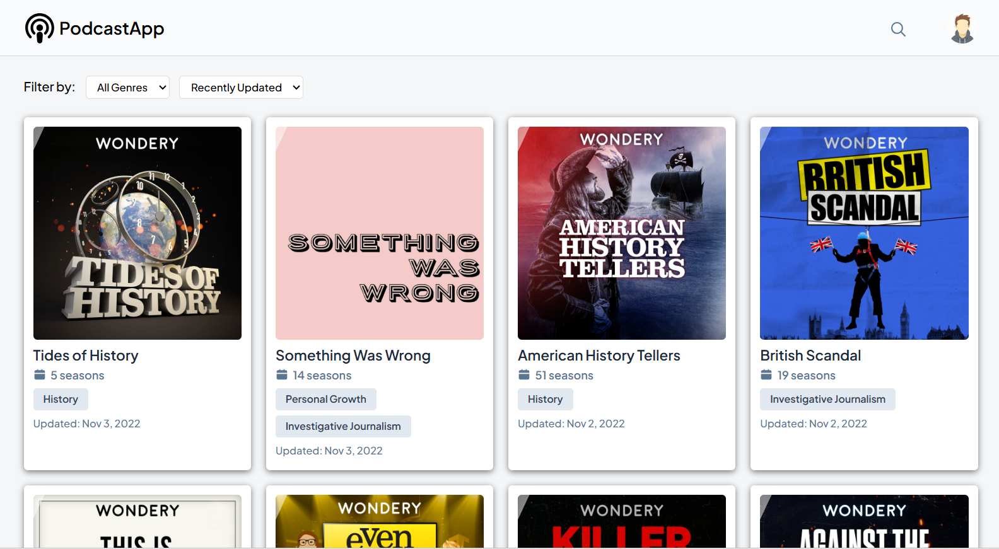
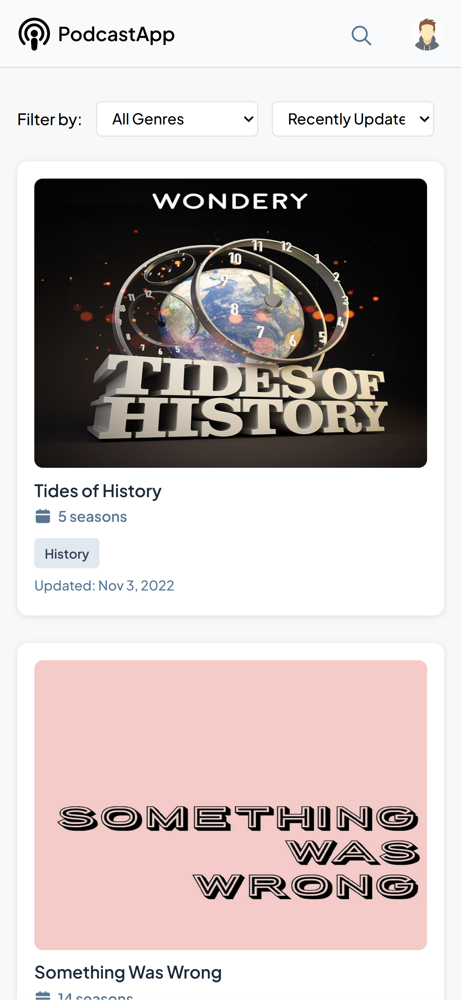

# 🎧 Vanilla JS PodcastApp

---

## Overview

A modern, modular **Podcast Web Application** that allows users to explore, search, and filter podcasts with detailed modal views. The app is built with **clean architecture**, following **OOP and SOLID principles**, and written entirely in **vanilla JavaScript (ES modules)**.

---

## 📘 Project Description

**PodcastApp** is a lightweight, client-side application designed to let users:
- Browse available podcasts,
- Filter them by genre or sort order,
- Perform live search,
- View detailed information in a modal,
- Enjoy smooth UX with animations and mobile responsiveness.

It is architected for **maintainability**, **scalability**, and **clarity**, using a modular design pattern that separates data, utilities, components, and controllers.

---

## 🛠️ Technologies Used

| Category | Tools / Languages |
|-----------|------------------|
| **Frontend** | HTML5, CSS3, JavaScript (ES6 Modules) |
| **Architecture** | Object-Oriented Programming (OOP), SOLID, Functional Utilities |
| **Documentation** | JSDoc |
| **Design** | Responsive Layout, Flexbox, CSS Grid |
| **Assets** | SVG Icons (custom: podcast, search, user, seasons, calendar) |

---

## 🌟 Features

### 🧩 Core Functionalities
- **Podcast Listing** – Displays all available podcasts dynamically.
- **Genre Filtering** – Filters podcasts by genre using dropdown options.
- **Sorting** – Sorts podcasts by most recent, newest, or popularity.
- **Search** – Provides live filtering as the user types, and search-on-enter behavior.
- **Modal View** – Displays detailed podcast info including description, genres, and seasons.

### 💡 Additional Enhancements
- **Auto Live Search** — Podcasts filter in real-time as you type.
- **Page Reload Icon** — Clicking the podcast icon reloads the app with a smooth fade-out animation.
- **Responsive Design** — Fully optimized for desktop, tablet, and mobile.
- **Animated Podcast Covers** — Flip animation on hover with subtle shine effects.
- **Thematic Modal Styling** — Centered, scrollable, and width-adjusted dynamically.

---

## 📁 Project Structure

```
📂 PodcastApp/
│
├── index.html               # Main HTML layout
├── styles.css               # Global and responsive styles
├── main.js                  # Entry point script
│
├── 📂 components/
│   ├── ModalManager.js      # Handles modal opening and closing
│   ├── PodcastFilter.js     # Filters and sorts podcast data
│   ├── PodcastRenderer.js   # Dynamically renders podcast cards
│
├── 📂 utils/
│   ├── dateUtils.js         # Formats ISO dates into readable text
│   ├── genreUtils.js        # Genre name and parsing helpers
│   ├── seasonUtils.js       # Season data retrieval utility
│
├── PodcastApp.js            # Main controller class
├── data.js                  # Podcast, genres, and seasons dataset
└── 📂 image/                 # SVG icons and assets
```

---

## ⚙️ Setup Instructions

### 🧩 Steps
1. **Clone or download** this repository:
   ```bash
   git clone https://github.com/Davidaniekan/DAVANI25160_PTO2503_A_David-Aniekan_DJS01.git
   ```
2. **Open the project folder:**
   ```bash
   cd podcastapp
   ```
3. **Run the app locally:**
   - Double-click `index.html`
   
4. Visit:  
   ```
   http://localhost:5500
   ```

---

## 🚀 Usage Guide

1. **Browse Podcasts:**  
   Scroll through the dynamically generated podcast list.

2. **Search:**  
   - Click the 🔍 icon to open the search bar.  
   - Type any podcast name or genre.  
   - Results update automatically as you type.  
   - Press **Enter** to finalize the search (input loses focus but retains text).

3. **Filter by Genre:**  
   - Select any genre from the “Filter by” dropdown.  
   - Results instantly update.

4. **Sort Podcasts:**  
   - Choose **Recently Updated**, **Most Popular**, or **Newest**.

5. **Open Modal:**  
   - Click on any podcast card to open detailed view.  
   - Press **Esc** or click outside the modal to close it.

6. **Reload App:**  
   - Click the podcast icon to reload with a fade-out animation.

---
## 🌐 Live Demo

- **Check out the project here:** [PodcastApp](https://podcastappstream.netlify.app)

---

## 🖼️ Screenshots

### 🖥️ Desktop View



### 📱 Mobile View


---

## 👤 Author

Developed by **David Aniekan**
[GitHub](https://github.com/Davidaniekan) | [LinkedIn](https://linkedin.com/in/david-aniekan)
